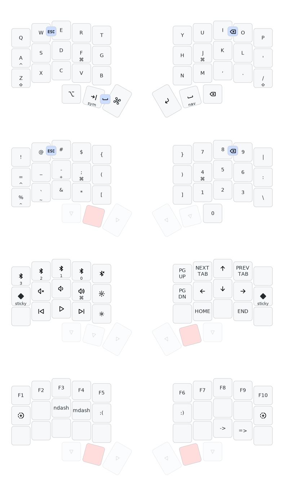

# crkbd keymap

Ideas borrowed from [Miryoku][] and [Evan Travers][].
Thanks also to [Nick Coutsos][] for his invaluable [Keymap Editor][].
Keymap generated with [keymap-drawer][] and [Tabler Icons][].

[Miryoku]: https://github.com/manna-harbour/miryoku/
[Evan Travers]: https://evantravers.com/articles/2023/05/27/5x3-3-keyboard-layout/
[Nick Coutsos]: https://nickcoutsos.github.io/
[Keymap Editor]: https://nickcoutsos.github.io/keymap-editor/
[keymap-drawer]: https://github.com/caksoylar/keymap-drawer
[Tabler Icons]: https://tabler-icons.io/

## TODO

- [ ] consider miryoku-style cut/copy/paste shortcuts
- [ ] function keys
- [ ] maybe add some cmd-key shortcuts to nav layer; quit, close, screenshot
- [ ] easy way to hold spacebar
- [ ] right side bootloader
